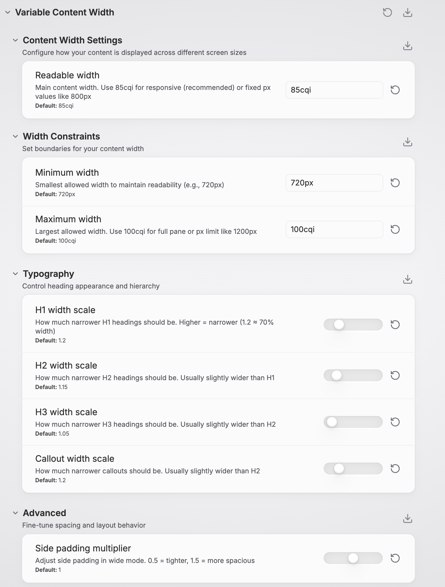

# Variable Content Width for Obsidian

A sophisticated CSS snippet that makes Obsidian's content area width adaptive, configurable, and responsive to pane splits. Transform your Obsidian experience with intelligent content width management that works seamlessly across all view modes and screen sizes.



## Features

### Intelligent Width Control
- **Container Query Based**: Uses modern CSS container queries for true responsive design per pane
- **Style Settings Integration**: Full GUI control through the Style Settings plugin
- **Split-Pane Aware**: Automatically adapts to narrow/wide panes in split view
- **Readable Line Length Compatible**: Works with Obsidian's native toggle

### Responsive Design
- **Desktop Optimized**: Smart width management for screens ≥1024px
- **Mobile Friendly**: Follows theme defaults on smaller screens
- **Container Queries**: Tables and diagrams adapt based on pane width
- **Print Optimized**: Clean layout for PDF export

### Typography Excellence
- **Heading Hierarchy**: H1, H2, H3 with independent width controls
- **Callout Styling**: Configurable callout width for better balance
- **Visual Polish**: Centered headings and optimized spacing
- **Accessibility**: High contrast and reduced motion support

### Advanced Customization
- **Min/Max Constraints**: Set readable width boundaries
- **Padding Control**: Adjustable side padding in wide mode
- **Element Breakout**: Tables and diagrams can expand beyond content width
- **Real-time Updates**: Changes apply instantly via Style Settings

## Quick Start

### Compatible with
- [Style Settings Plugin](https://github.com/mgmeyers/obsidian-style-settings) (for GUI controls)

### Installation

1. **Download the CSS file**:
   - Download [`variable-content-width.css`](variable-content-width.css)
   - Or copy the CSS content from the file

2. **Install in Obsidian**:
   - Open Obsidian Settings → Appearance → CSS Snippets
   - Click the folder icon to open snippets folder
   - Place `variable-content-width.css` in the folder
   - Refresh the snippets list and enable "Variable Content Width"

3. **Configure via Style Settings**:
   - Install the Style Settings plugin if you haven't already
   - Go to Settings → Style Settings → Variable Content Width
   - Adjust settings to your preference

## Usage

### Basic Configuration

The snippet works great with default settings, but you can customize everything:

#### **Main Settings**
- **Readable Width**: `85cqi` (responsive) or `800px` (fixed)
- **Min Width**: `720px` (readability floor)
- **Max Width**: `100cqi` (full pane) or `1200px` (cap)

#### **Typography Controls**
- **H1 Scale**: `1.2` (makes H1 ~70% of content width)
- **H2 Scale**: `1.15` (slightly wider than H1)
- **H3 Scale**: `1.05` (even wider)
- **Callout Scale**: `1.2` (narrow callouts for focus)

#### **Advanced**
- **Padding Scale**: `1.0` (adjust side spacing in wide mode)

### Understanding Container Units

The snippet uses `cqi` (container inline size) units for true responsive design:

```css
/* Responsive - adapts to pane width */
--vcw-set-readable-width: 85cqi;

/* Fixed - always the same size */
--vcw-set-readable-width: 800px;
```

**Why `cqi` is better**: In split view, `85cqi` means 85% of the *pane* width, not the entire screen. This ensures optimal readability in both full-width and split layouts.

### View Mode Behavior

#### **Readable Line Length: ON**
- Content is centered with your configured constraints
- Works in both source and preview modes
- Headings and callouts follow typography hierarchy

#### **Readable Line Length: OFF**
- Content uses full pane width with smart side padding
- Tables and diagrams can expand to full width
- Still respects max-width constraints for readability

## Advanced Features

### Responsive Elements

Elements adapt based on pane width:

```css
/* Medium panes (≥900px): Tables get more room */
@container content-view (min-width: 900px) {
  .markdown-rendered table {
    width: min(100cqi, calc(readable-width * 1.2));
  }
}

/* Large panes (≥1200px): Full-width elements */
@container content-view (min-width: 1200px) {
  .markdown-rendered table {
    width: 100%;
  }
}
```

### Element Breakout

Mark content for special treatment:

- **Wide Images**: `` (alt text contains "wide")
- **Wide Callouts**: `> [!wide]` callouts
- **Tables**: Automatically expand on large panes

### Print & Export

Optimized for clean PDF exports:
- Removes width constraints for full-page content
- Maintains readability without artificial limitations
- Works with Obsidian's native export features

## Technical Details

### Theme Compatibility

The Variable Content Width snippet has been tested and verified to work seamlessly with:

#### **Official Themes**
- **Default** - Obsidian's built-in theme

#### **Community Themes**
- **[Retroma](https://github.com/emarpiee/Retroma)** - Retro-inspired minimalist theme
- **[Minimal](https://github.com/kepano/obsidian-minimal)** - Clean, focused writing experience
- **[Velocity](https://github.com/Gonzalo-D-Sales/obsidian-velocity)** - Modern, fast-loading theme
- **[Primary](https://github.com/primary-theme/obsidian)** - Bold, colorful design system
- **[Cupertino 2](https://github.com/aaaaalexis/obsidian-cupertino)** - macOS-inspired interface
- **[Fancy-a-Story](https://github.com/ElsaTam/obsidian-fancy-a-story)** - Creative writing focused
- **[Vesnea Vibe](https://github.com/seavalanche/vesnea-obsidian-theme)** - Vibrant, modern aesthetic

> **Note**: The snippet uses Obsidian's core CSS classes and container structure, making it compatible with most well-built community themes. If you encounter issues with a specific theme, please [report it](https://github.com/Bregor/obsidian-variable-content-width/issues) so we can investigate compatibility.

### Browser Compatibility

- **Container Queries**: Chrome 105+, Firefox 110+, Safari 16+
- **Logical Properties**: All modern browsers
- **CSS Variables**: Universal support
- **Graceful Degradation**: Older browsers get fixed layouts

### Performance

- **Efficient Selectors**: Minimal DOM traversal
- **Hardware Acceleration**: Uses `transform` where beneficial
- **Memory Footprint**: <10KB CSS, no JavaScript
- **Calculation Caching**: Browser optimizes `calc()` expressions

### Architecture

```
Variable Content Width
├── Root Variables (Style Settings controlled)
├── Desktop Layout (≥1024px)
│   ├── Container Definitions
│   ├── Readable Mode (centered content)
│   ├── Wide Mode (padded content)
│   ├── Typography Hierarchy
│   └── Responsive Elements
├── Mobile Layout (≤1023px)
├── Accessibility Features
└── Print Styles
```

## Customization Examples

### Academic Writing Setup
```css
:root {
  --vcw-set-readable-width: 70cqi;  /* Narrower for focus */
  --vcw-set-h1-scale: 1.5;          /* Very narrow titles */
  --vcw-set-callout-scale: 1.1;     /* Wider callouts for quotes */
}
```

### Design/Creative Setup
```css
:root {
  --vcw-set-readable-width: 95cqi;  /* Wide for images */
  --vcw-set-padding-scale: 0.5;     /* Minimal padding */
  --vcw-set-max-width: 1400px;      /* High resolution cap */
}
```

### Coding/Technical Setup
```css
:root {
  --vcw-set-readable-width: 90cqi;  /* Wide for code blocks */
  --vcw-set-h1-scale: 1.1;          /* Wide headings */
  --vcw-set-padding-scale: 0.3;     /* Tight spacing */
}
```

## Troubleshooting

### Common Issues

**Q: Changes don't apply immediately**
A: Refresh Obsidian or toggle the CSS snippet off/on in Appearance settings.

**Q: Source mode content is too narrow**
A: Ensure "Readable line length" setting matches your preference in Settings → Editor → Display.

**Q: Container queries not working**
A: Update to a recent Obsidian version. Older versions may not support container queries.

**Q: Style Settings not showing options**
A: Make sure the Style Settings plugin is installed and enabled.

### Debugging

Enable debug mode by temporarily adding:
```css
.markdown-preview-sizer,
.cm-sizer {
  outline: 1px dashed red !important;
}
```

This shows content boundaries to help troubleshoot layout issues.

## Contributing

Contributions are welcome! Please:

1. **Fork** this repository
2. **Create** a feature branch (`git checkout -b feature/amazing-feature`)
3. **Test** your changes across different themes and screen sizes
4. **Commit** your changes (`git commit -m 'Add amazing feature'`)
5. **Push** to the branch (`git push origin feature/amazing-feature`)
6. **Open** a Pull Request

### Development Setup

1. Clone the repository
2. Make changes to `variable-content-width.css`
3. Test in Obsidian with various themes and content types
4. Ensure Style Settings integration works correctly
5. Verify mobile responsiveness

## License

This project is licensed under the MIT License - see the [LICENSE](LICENSE) file for details.

## Acknowledgments

- **Obsidian Team** for the excellent platform and CSS hooks
- **Style Settings Plugin** developers for the configuration framework
- **Obsidian Community** for feedback and testing
- **CSS Container Queries** specification for enabling true responsive design

## Support

- **Issues**: [GitHub Issues](https://github.com/Bregor/obsidian-variable-content-width/issues)
- **Discussions**: [GitHub Discussions](https://github.com/Bregor/obsidian-variable-content-width/discussions)

---

**Made with ❤️ for the Obsidian Community**
